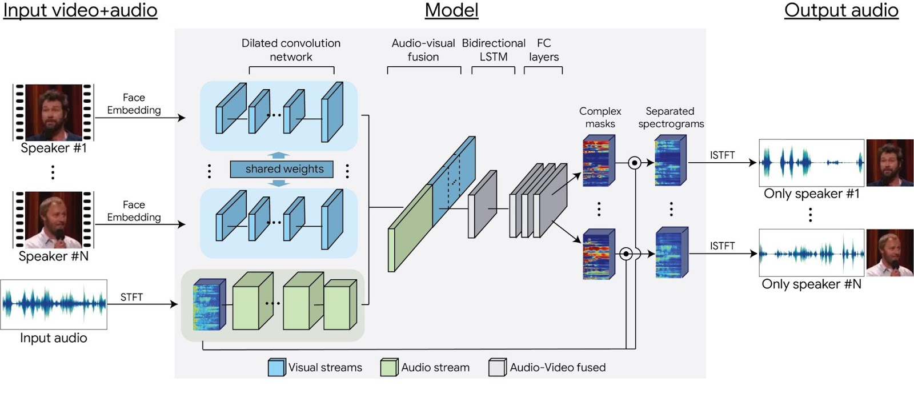

# speech_separation

# Overview

This is a project to improve the speech separation task. In this project, Audio-only and Audio-Visual deep learning separation models are modified based on the paper [Lookng to Listen at the Cocktail Party](https://arxiv.org/abs/1804.03619)[1]. 

# Data

[AVspeech dataset](https://looking-to-listen.github.io/) : contains 4700 hours of video segments, from a total of 290k YouTube videos.

Customized video and audio downloader are provided in [audio](https://github.com/bill9800/speech_separation/tree/master/data/audio) and [video](https://github.com/bill9800/speech_separation/tree/master/data/video). (based on youtube-dl,sox,ffmpeg)  

# Preprocessing

There are several preprocess functions in the [utils](https://github.com/bill9800/speech_separation/tree/master/model/lib). Including STFT, iSTFT, power-law compression, complex mask and modified hyperbolic tangent[5] etc. Below is the preprocessing for audio data:

For the visual part, MTCNN is applied to detect face and correct it by checking the provided face center[2]. The visual frames are transfered to 1792 (lowest layer in the network that is not spatially varying) face embeddings features with pre-trained FaceNet model[3]. Below is the preprocessing for visual data:

# Model

Audio-only model is provided in [model_v1](https://github.com/bill9800/speech_separation/tree/master/model/model_v1) and Audio-visual model is provided in [model_v2](https://github.com/bill9800/speech_separation/tree/master/model/model_v2).

Follwing is the brief structure of Audio-Visual model, some layers are revised corresponding to our customized compression and dataset.[1] 

# Training 

Loss function : modified discriminative loss function inspired from paper[4].

Optimizer : Adam 

# Prediction

Apply complex ratio mask (cRM) to STFT of the mixed speech, we can produce the STFT of single speaker’s speech.

Samples to complete the prediction are provided in eval file in [model_v1](https://github.com/bill9800/speech_separation/tree/master/model/model_v1) and [model_v2](https://github.com/bill9800/speech_separation/tree/master/model/model_v2).

# Reference

[1] [Lookng to Listen at the Cocktail Party:A Speaker-Independent Audio-Visual Model for Speech Separation, A. Ephrat et al., arXiv:1804.03619v2 [cs.SD] 9 Aug 2018](https://arxiv.org/abs/1804.03619)

[2] [MTCNN face detection](https://github.com/ipazc/mtcnn)

[3] [FaceNet Pretrained model](https://github.com/davidsandberg/facenet)

[4] [Joint Optimization of Masks and Deep Recurrent Neural Networks for Monaural Source Separation, P. Hunag et al,arXiv:1502.04149v4 [cs.SD] 1 Oct 2015](https://arxiv.org/abs/1502.04149)

[5] [Complex Ratio Masking for Monaural Speech Separation](https://ieeexplore.ieee.org/document/7364200)
